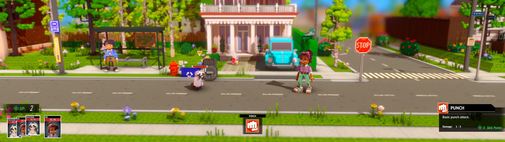

## Echo Generation ultrawide and wider

The tool forces the game to support your resolution, which is useful for removing the side black bars at 21:9 and 32:9.

It also corrects the user interface, however, the spanning would not be ideal for a triple monitor setup.

1. [Download](/../../releases) and unpack the archive.
2. Launch the game first, followed by the tool.
3. Press the hotkey and select any in-game resolution if necessary.

All trainers based on CE components may trigger some anti-virus software.

Tested on the latest Microsoft Store version at 2560x1080 and 3840x1080.

You can buy me a [coffee](https://ko-fi.com/rozziroxx) or become a [patron](https://www.patreon.com/rozzi).

